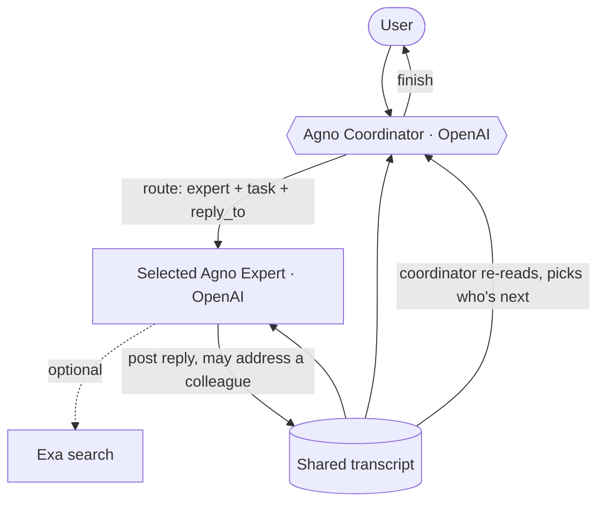

```mermaid
flowchart TD
    User([User]) --> Coord{{Agno Coordinator · OpenAI}}
    Transcript[(Shared transcript)] --> Coord

    Coord -->|finish| User
    Coord -->|route: expert + task + reply_to| Expert[Selected Agno Expert · OpenAI]

    Transcript --> Expert
    Expert -.optional.-> Exa[Exa search]
    Expert -->|post reply, may address a colleague| Transcript
    Transcript -->|coordinator re-reads, picks who's next| Coord
```
