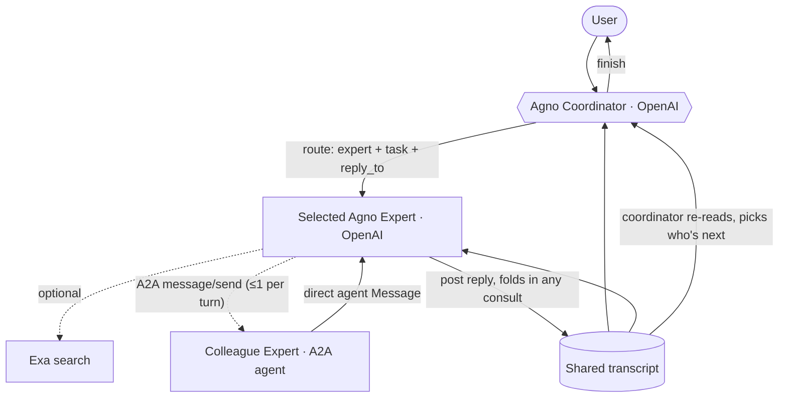

## Agent-to-agent (A2A) communication

Experts are also exposed as **formal A2A (Agent2Agent) agents**. Each persona has an
Agent Card and a JSON-RPC `message/send` endpoint (spec types from `a2a-sdk`, served
by `backend/a2a_server.py`):

- `GET /a2a/{room}/{member}/.well-known/agent-card.json` → the expert's Agent Card.
- `POST /a2a/{room}/{member}` → JSON-RPC 2.0 `message/send`, returning a direct
  `agent`-role `Message` (synchronous; no task lifecycle or streaming).

During a group turn, the coordinator-selected **primary** expert may consult **one**
colleague directly over A2A via the `ask_colleague(member_id, question)` tool — a real
in-process JSON-RPC round-trip. The colleague's answer is folded into the primary
expert's single reply and attributed in prose; it is never emitted as a separate
message, so the `/chat` single-reply contract is unchanged.

### Invariants / limits

- **Depth 1, no cycles**: only the primary expert gets the consult tool. A *consulted*
  expert runs without it, so A→B→A recursion is impossible.
- **Budget**: at most one consult per turn.
- **Timeout**: the consult uses minimal reasoning effort and a short timeout (≈18s,
  capped at 20s by the tool) so `1 primary + 1 consult` stays inside `/chat`'s 50s
  budget and the Next proxy's 55s cap; on timeout the primary proceeds without it.
- **Discovery deviation**: cards live under a per-expert path
  (`/a2a/{room}/{member}/.well-known/...`) rather than one root-level `.well-known`.
- All A2A endpoints require the same `Bearer AGNO_API_TOKEN` as `/chat`.
