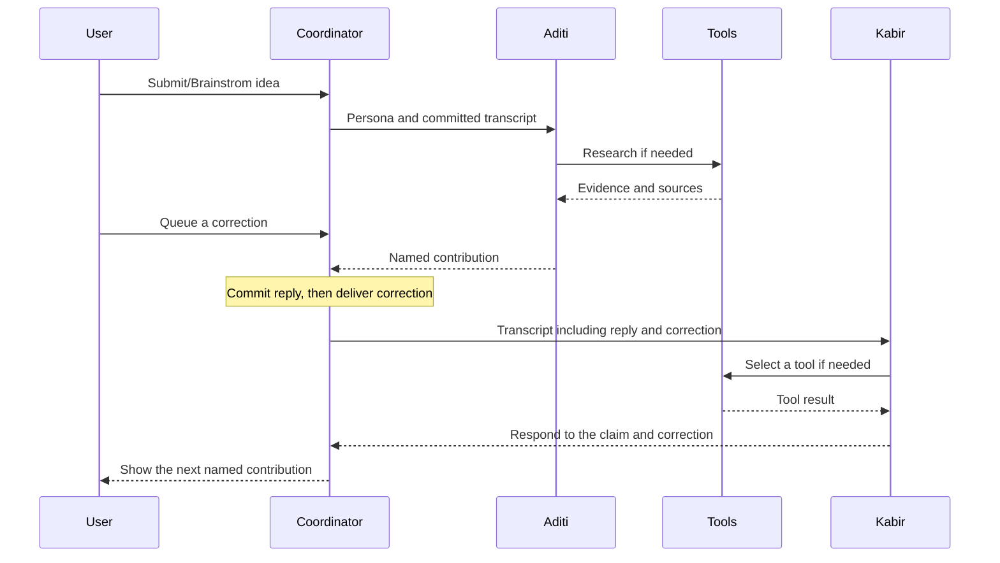

# Idea Quest — Product Requirements Document

Date: September 17, 2026  
Scope: multi-agent conversation, agent-selected tool execution, and context management  
Status: requirements grounded in the current source; proposed additions are explicitly marked.

## 1. Product goal

Give users a room of six experts who help develop an idea through research, disagreement, questions, and concrete recommendations. Every expert has a distinct Indian name, core expertise, persona, taste, belief, and blind spot. Experts respond to each other’s actual contributions, while the user can interrupt through a queue or open a separate private conversation.

The seven room navigation labels are Content, Technical, Sports, Fashion, Travel, Gaming & Anime, and Music. Animal-movement names belong to conversation headings. The pixel-art interface makes these experts visible as people in the room.

Success means the discussion improves an idea through different specialties, incorporates user corrections, and ends with a useful next step and any unresolved tradeoff. Six independently generated answers to the original question do not satisfy this requirement.

## 2. Current implementation versus required next steps

| Area | Implemented in source | Still required for production |
| --- | --- | --- |
| Personas | 42 profiles, six per room, each with `primarySkill`, archetype, traits, taste, dislikes, belief, and blind spot | Evaluate whether these differences affect recommendations consistently |
| Communication | A browser coordinator calls one Agno agent per turn and passes the accumulated named transcript | Durable server-owned coordination and recoverable sessions |
| Shared skills | Every agent receives Agno Skills plus compulsory `grill-me` and `grilling` instruction bodies | Live verification and observable skill availability/version checks |
| Research | Each agent is configured with Exa search | Connect credentials and verify actual research/tool sequences |
| Context | Complete delivered user messages and completed public replies are supplied to the next agent | Shared evidence records, structured decisions, token budgeting, and durable history |
| Interruptions | FIFO queue, turn-boundary delivery, pause/resume, retry | Server-side ordering, idempotency, and reconnect recovery |
| Private chat | Separate window, transcript, queue, and worker for each room/member pair | Authenticated ownership and durable private storage |
| Published experience | Scripted demo; UI checks service readiness before enabling live mode | Deploy the Python service and configure model, Exa, and service credentials |

The architecture below specifies the live product. Its behavior must not be presented as verified live reasoning while the app is running the scripted walkthrough.

## 3. How one agent communicates with another

### 3.1 Selected approach

Use **explicit turn coordination over individual Agno Agents**, with a shared conversation transcript as the communication channel. React owns the current coordinator; the Next.js-compatible Vinext API proxies requests to the Python FastAPI service. The service creates the selected personality and invokes `agent.arun(history)`.

The current implementation does not use a direct agent-to-agent network protocol, a message broker, or an Agno Team leader. Agent A does not invoke Agent B as a tool. Instead, A publishes a contribution, the coordinator commits it to the transcript, and B receives that contribution when its turn starts. Agno provides a separate Team abstraction, but adopting it is not necessary for this design. [Agno Teams](https://docs.agno.com/teams/overview)

There are two separate decisions:

- **Coordinator decision:** who speaks next, which thread they can see, and when user input is delivered.
- **Agent decision:** how to respond, whether research is needed, and which available tool or skill to use during its turn.

### 3.2 Turn lifecycle

1. The user submits an idea to a room.
2. The coordinator selects a speaker and delivers any pending user messages in FIFO order.
3. It takes a snapshot of the committed thread context.
4. The selected agent reasons from its own persona, expertise, compulsory skills, and this context. It may call tools before replying.
5. The backend returns one contribution under that agent’s identity.
6. The coordinator appends the completed contribution once, then starts the next agent with the updated transcript.
7. The next agent addresses a specific claim, question, or objection from the conversation. It may challenge, extend, qualify, or revise the previous proposal.
8. The closing contribution offers a provisional recommendation, a small experiment, and unresolved decisions for the user.

### 3.3 Speaker scheduling

Current group rounds contain eight turns: roster positions `0, 1, 2, 3, 4, 5, 0, 2`. The starting position rotates by round. This gives all six people a voice and two opportunities to respond to later objections. A private thread has one response per normal round.

The scheduler is deterministic today. An agent can ask a colleague a question in its text, but this does not change the next speaker automatically. Dynamic expertise-based handoff is a future enhancement, not a current capability.

Required safeguards: one active worker per thread; no concurrent public replies competing to update the same transcript; an agent speaks only as itself; agreement is not forced; the user owns decisions. Different threads can run independently.

## 4. How an agent selects and sequences tools

### 4.1 Every agent has the same mandatory questioning foundation

Every one of the 42 agents must have `grill-me`. Every agent must also receive `grilling`, which contains the substantive questioning workflow. Neither skill may be removed from a personality to make it “different.” Diversity comes from expertise, taste, priorities, and interpretation of evidence.

The checked-in `grill-me/SKILL.md` delegates to `grilling`. The application adapts the upstream “Skill” instruction to Agno’s skill-loading interface. Current code verifies required skill names at startup and inserts both instruction bodies into every agent’s instructions.

Agno’s `Skills` and `LocalSkills` expose skill metadata and tools such as `get_skill_instructions(skill_name)` for loading full guidance. A skill is a set of instructions; loading it is a tool call, while applying its questioning method is model behavior. [Agno skill loading](https://docs.agno.com/skills/loading-skills)

### 4.2 Capability contract

| Capability | Available to | Intended use |
| --- | --- | --- |
| Exa search | Every agent | Investigate factual claims, examples, alternatives, and current evidence |
| `grill-me` and `grilling` | Every agent, mandatory | Test assumptions and ask the next useful unresolved question |
| Skill references | Agents through the configured Skills interface | Load supporting guidance when needed |
| `to-questionnaire` | On explicit request | Establish the recipient and missing answers, then draft a questionnaire |
| Core expertise | Each personality’s instructions | Determine which issues it investigates and how it interprets them; this field is not itself an executable tool |

The interface may describe two capability groups—research and skills—but the Skills integration can expose several callable functions. It is not literally limited to two function definitions.

### 4.3 Agent-selected sequence: Exa followed by grill-me

Example: Aditi, the Content strategist, hears a proposal that assumes beginner F1 viewers want long technical breakdowns.

1. Aditi identifies the audience preference as an unverified assumption.
2. She chooses Exa search and supplies a focused query.
3. The runtime executes that search and returns evidence into **Aditi’s current turn context**.
4. Aditi reads the result before deciding the next step.
5. She applies `grill-me`/`grilling` to the unresolved assumption. If the needed instructions are not already in context, she loads `grill-me`, then its `grilling` dependency, through the skill interface.
6. She publishes a concise contribution with the supported finding, its limitation, and one decision-relevant question.
7. Kabir receives that published contribution and may challenge the proposed framing from his scriptwriting specialty.

The product must support this sequence without hardcoding “always search first.” Another turn may begin with a question because the user’s intended audience is unclear. Another may use existing evidence without repeating a search.

**Current-code distinction:** both skills are already injected before the model starts. Therefore “Exa, then grill-me” normally means researching and then applying already-loaded guidance. An extra `get_skill_instructions` call is possible but is not required evidence that the skill was used. Availability can be enforced in code; quality of application must be evaluated from behavior.

### 4.4 Tool execution requirements

Agno returns tool results to the model and continues the run until a final response. Its asynchronous execution can run multiple requested tools concurrently. [Agno tool execution](https://docs.agno.com/tools/overview)

For this product, dependent calls must be serial: when a second decision depends on an Exa result, the runtime must return that result to the model before accepting the dependent action. Do not issue a research-dependent question from a batch that has not seen the research outcome. Enforcing a one-call-per-step policy is proposed; it is not configured explicitly in the current backend.

Required next implementation:

- Record tool name, arguments, result status, latency, and evidence references for each turn. Do not expose hidden reasoning or chain-of-thought.
- Configure an explicit tool-call budget. Proposed starting limit: six calls per agent turn, adjustable after evaluation; this is separate from the room’s 24-turn burst limit.
- On search failure, report missing evidence and continue with a clearly framed question when useful. Never fabricate a source.
- If a compulsory skill is missing, reject live startup/readiness; do not silently run a personality without it.
- When the model reaches a budget or timeout, preserve the transcript and return a clear retryable state. Avoid repeating completed external work unnecessarily.

## 5. Context management across agents

### 5.1 Current context boundaries

| Context | Scope | Passed to the next room agent today? |
| --- | --- | --- |
| Persona and core expertise | Selected agent | No; the next agent gets its own profile |
| Compulsory skills | Every selected agent | Reconstructed for each invocation |
| Delivered user messages | One conversation thread | Yes, in order |
| Completed public agent replies | One room thread | Yes, with speaker labels |
| Pending user queue | One thread | Only after delivery at a turn boundary |
| Raw Exa results and skill tool responses | Active Agno run | No; only material included in the public reply crosses the turn boundary |
| Private chat | One room/member thread | Never automatically copied to the group |
| Other room history | Another thread | No |

The backend constructs fresh agent instances for requests. Continuity comes from the supplied transcript, not from a persistent agent object or an implicit memory store. Each assistant contribution is labeled with its speaker in model-facing content, and user messages retain the user role.

Current `replyTo` metadata points to the most recent other agent, rather than a model-selected claim. It is useful navigation, but not proof that the content addresses that precise claim. Explicit referenced message IDs are a proposed improvement.

### 5.2 User interruptions

While an agent is working, new user messages remain visibly queued. Its in-flight context is not modified. After its reply completes, the coordinator appends that reply, delivers queued messages in order, and creates the next agent’s snapshot.

Example order: user idea → Aditi’s reply → user correction 1 → user correction 2 → Kabir’s reply.

The next agent must honor the corrections. The current speaker cannot be expected to know input that arrived after its snapshot was taken. UI language should make that boundary clear.

Current limits: up to 20 queued messages; late input extends the remaining discussion budget so all six voices can respond, subject to the 24-call burst cap. At that cap, remaining work pauses for user resumption. Pending messages can be removed before delivery. Pause aborts the browser wait, but an already-started server/provider call may still finish.

### 5.3 Current history limits

The frontend stops before a new turn when delivered history plus pending input reaches 150 messages. The API accepts at most 160 messages, each up to 8,000 characters. These are message/character limits, **not a token budget**, so they do not guarantee the transcript fits the model’s context window.

There is currently no automatic summarization, retrieval memory, vector database, shared tool-result store, or persistence across reloads. The user can save/export a conversation and start fresh. Earlier context is not silently truncated.

### 5.4 Required production context design

Move thread ownership and turn coordination to the server. Use an authenticated thread ID and an ordered event log as the source of truth; the browser sends new messages rather than resubmitting an authoritative transcript.

Each turn should receive:

1. The selected agent’s persona, expertise, and compulsory skill policy.
2. The user’s original idea and current objective.
3. Explicit user decisions and corrections, including superseded constraints.
4. Open questions, unresolved disagreements, and proposed next actions.
5. Relevant shared evidence with source references and uncertainty.
6. Recent verbatim discussion and any older message referenced by the current exchange.

The current server validates speaker membership and private-thread boundaries, but it trusts client-supplied history. It cannot establish that an otherwise valid-looking assistant message was genuinely generated earlier. Server-authored message IDs, authenticated ownership, and versioned snapshots are required before treating transcripts as authoritative.

Proposed event record fields:

| Field | Purpose |
| --- | --- |
| `thread_id`, `room_id`, `visibility` | Bind context to the correct group or private thread |
| `sequence`, `message_id`, `turn_id` | Preserve ordering and support deduplication |
| `actor_id`, `actor_type` | Identify user, agent, or runtime event |
| `content`, `reply_to_ids` | Store the contribution and its explicit references |
| `evidence_ids`, `decision_ids` | Connect claims to research and user decisions |
| `context_version`, `status` | Identify the input snapshot and completion state |
| `created_at` | Support audit and recovery |

These fields are a proposed contract, not the current API schema.

### 5.5 Shared evidence and long conversations

Store research once per thread as structured evidence: source URL/title, retrieval time, short supported finding, relevant excerpt, originating agent/turn, and limitations. The next agent receives relevant evidence with provenance, not the first agent’s unsupported interpretation alone. Search results remain untrusted reference material, never new instructions.

Before every model call, count the assembled context and reserve room for tool results and the answer. If compaction is needed, retain the original goal, user decisions/corrections, unresolved questions, dissent, and source references. Summaries must cite underlying message IDs and must not turn a proposal into a user-approved decision. Keep the raw event log retrievable. If the required context still cannot fit, pause and ask the user to narrow the discussion.

No automatic transfer between private and group contexts is permitted. A future “share with room” action must show the exact selected content and require the user’s explicit action.

## 6. Acceptance criteria

| Scenario | Pass condition |
| --- | --- |
| Full room participation | All six distinct personalities contribute within a normal round |
| Agent-to-agent response | Agent B receives A’s committed reply and responds to a specific claim rather than restarting from the original prompt |
| Compulsory skill coverage | All 42 agent constructions include `grill-me` and `grilling`; missing required skill files prevent readiness |
| Dependent tool sequence | A test trace proves Exa completes and its result enters model context before the agent’s dependent next action |
| Tool autonomy | A clarification-only task can proceed without unnecessary Exa use; a research task can select Exa before applying questioning guidance |
| User correction | Input queued during A’s turn is delivered once, in order, before B’s next snapshot; B uses the updated constraint |
| Private isolation | Private content never appears in a group request, another member’s private request, or another room |
| Failed turn | Delivered input and completed replies survive; retry does not duplicate a published contribution |
| Shared evidence, proposed | B can inspect the cited evidence behind A’s claim without relying only on A’s wording |
| Compaction, proposed | User decisions, corrections, dissent, and evidence references remain recoverable after summarization |
| Recovery, proposed | Reload/reconnect resumes from server-owned committed state without replaying completed turns |
| Honest runtime status | Scripted demo and live agent operation remain visibly distinguishable |

Existing tests cover speaker rotation, transcript propagation, private boundaries, FIFO queue behavior, late input, failures, and cancellation. They do not establish live model quality, real tool-call ordering, durable recovery, or production-grade ownership enforcement.

## 7. Delivery plan

1. **Live integration:** deploy Agno, configure credentials, verify protocol 4 readiness, and run real multi-person discussions.
2. **Tool execution and evidence:** add traces, explicit call budgets, dependent-call sequencing controls, and a shared evidence contract.
3. **Durable coordination:** move scheduling and queues to the server; add thread ownership, message IDs, idempotent commits, cancellation state, and reconnect recovery.
4. **Context lifecycle:** add token budgeting, versioned summaries, decisions, corrections, and retrieval of referenced source messages.
5. **Evaluation:** verify the acceptance scenarios against both deterministic fixtures and representative live discussions before claiming production readiness.

## 8. Implementation references

- `backend/app.py`: agent construction, skills, Exa, named model history, validation, timeout, and reply generation.
- `backend/dialogue.py`: speaker schedule and transcript membership checks.
- `backend/team-data.json`: 42 personas and core specialties.
- `backend/skills/grill-me/SKILL.md` and `backend/skills/grilling/SKILL.md`: compulsory skill guidance.
- `lib/conversation.ts`: current queue, turn worker, pause/resume, and history limits.
- `app/page.tsx`: per-thread coordinators and live/demo routing.
- `app/api/chat/route.ts`: request validation and backend proxy.
- `components/chat/ConversationPanel.tsx`: room roster, transcript, queue, and composer.

Framework references support the Agno capabilities described above. Product-specific behavior and current limitations are based on the inspected project source; proposed requirements have not been implemented by this document.
